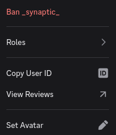
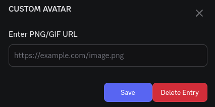

# ChangeFriendAvatar
A Vencord/Equicord plugin for changing your friend's profile pictures similar to how you can change their nicknames. 

Now I know the top one LOOKS appealing but that's not the main focus  
   

# Installation
1. Obtain a git release of Vencord or Equicord, and install pnpm, nodejs, and git. [https://docs.vencord.dev/installing/](https://docs.vencord.dev/installing/). Stop after runnning `pnpm install`.
2. Download the .zip release, and unzip it. Place the folder called `changeFriendAvatar` (if one doesn't exist after unzipping, make one and place zip contents in it.) in Vencord/src/plugins or Equicord/src/plugins
3. Build vencord and inject it. [https://docs.vencord.dev/installing/#building-vencord](https://docs.vencord.dev/installing/#building-vencord)
4. Restart Discord (If previously open)
5. Enable the plugin in Settings > Vencord/Equicord > Plugins

# Credits
- [Sophie](https://github.com/soap-phia/)
- [EpicDevices](https://github.com/epic-devices/)
